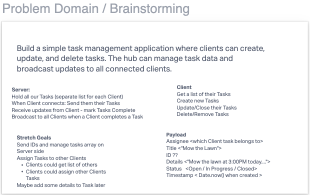
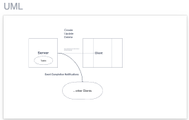
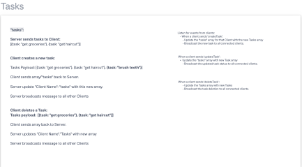
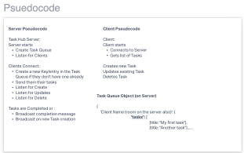
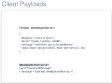

# Task Management Application

This is a simple task management application built using Node.js and Socket.IO. It allows clients to create, update, and delete tasks, with the hub server managing task data and broadcasting updates to all connected clients.

## Features

- Clients can:
  - Create new tasks
  - Update existing tasks
  - Delete tasks
- Hub server moderates all events and manages task data
- Real-time updates broadcasted to all connected clients

## Getting Started

### Prerequisites

### Installation

1. Clone the repository:

   ```bash
   git clone https://github.com/your-username/task-management-app.git
   cd task-management-app

### Install dependencies

- npm install
- npm init -y
- npm socket.io
- npm socket.io-client

### Usage

Start the hub server:
node hub.js

Start one or more clients:
node client.js

## Contributors

Josh Easley, Adnan Mohamud






